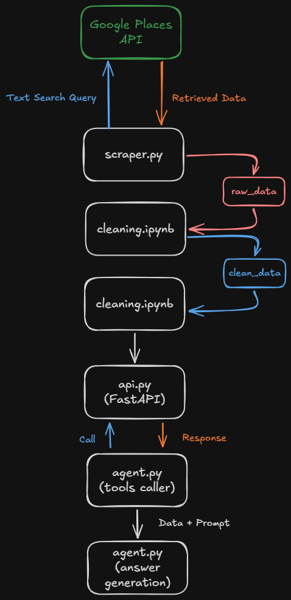

# UrbanSolv Test Case

## Pipeline
<p align="center">
  
</p>

## Task 1 — Data Collection
Business data is collected using **Google Places API (New)** Text Search for the keywords:

- Bakmi
- Ramen

So the query into the API Text Search will be `{keywords} Kecamatan Tembalang Semarang`.
Also when running, there will be place id duplicate check, so the result will have no duplicate.

The dataset will contain fields such as:

- Business name
- Address
- Business type
- Rating
- Review count
- Operating hours
- Price range
- Latitude and longitude
- Phone number
- Website

This task is implemented into **scraping.py** script and the result will be saved as **raw_data.csv**

## Task 2 — Data Cleaning

The raw data is cleaned by:

- Doing some basic data health check
- Keeping missing optional values as null
- Extracting `kelurahan` and `kecamatan` from the address
- Filtering records based on `kecamatan` == `Tembalang`
- Standardizing column names

This task is implemented in **cleaning.ipynb** notebook and the result will be saved as **clean_data.csv**

## Task 3 — REST API

The cleaned dataset is exposed using **FastAPI** implented in **api.py** script.

Required endpoints:

```text
GET /businesses
GET /businesses/search
GET /statistics
GET /docs
```

To start the API using uvicorn:

```bash
uvicorn api:app --reload
```

Swagger documentation:

```text
http://127.0.0.1:8000/docs
```

## Task 4 — AI Agent

The AI Agent uses **Groq API** with tool/function calling.

The LLM calls the REST API to retrieve structured business data using the tool/function caller. The retrieved response/data will be fetched into Groq's LLM ``openai/gpt-oss-120b`` along with the prompt.
Example questions:

```text
Cari ramen dengan rating di atas 4.7

Bakmi mana yang buka sampai jam 22.00?

Mana restoran yang reviewnya paling banyak?

Ada berapa bisnis ramen di Kelurahan Bulusan?
```

This task is implemented in **agent.py** and you need to start the FastAPI server first before using the agent.

## Environment Variables

Create a `.env` file:

```env
GOOGLE_MAPS_API_KEY=your_google_places_api_key
GROQ_API_KEY=your_groq_api_key
```

## Installation

```bash
pip install pandas requests python-dotenv fastapi uvicorn groq
```

## Notes

- Missing values are not imputed to avoid creating artificial business information.
- `keyword` represents the Google Places search keyword that returned the business and does not always represent the exact business category.
- The AI Agent uses the cleaned dataset/API as its primary source of truth.
